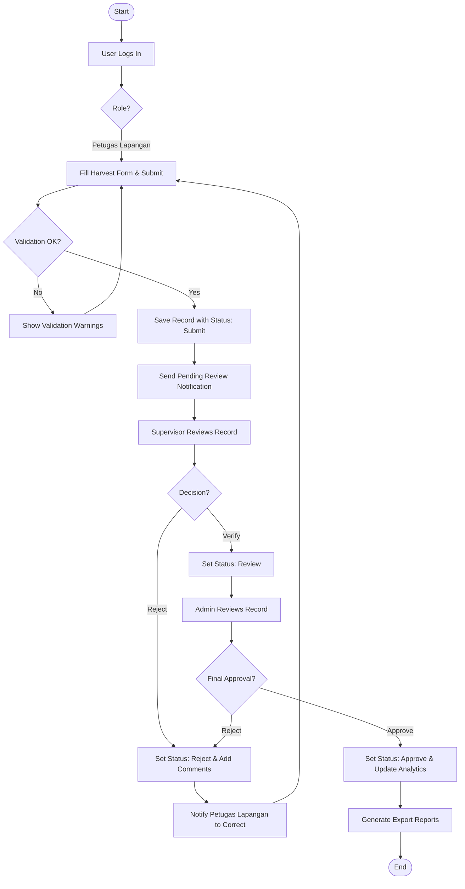

# Activity Diagram
## Process: Harvest Data Collection & Approval Workflow

```mermaid
flowchart TD
    start([Start]) --> login[User Logs In]
    login --> roleCheck{Role?}
    
    roleCheck -- Petugas Lapangan --> inputData[Fill Harvest Form & Submit]
    inputData --> validation{Validation OK?}
    validation -- No --> showErrors[Show Validation Warnings] --> inputData
    validation -- Yes --> saveDraft[Save Record with Status: Submit]
    
    saveDraft --> notifySupervisor[Send Pending Review Notification]
    notifySupervisor --> supervisorLogin[Supervisor Reviews Record]
    
    supervisorLogin --> supervisorAction{Decision?}
    supervisorAction -- Reject --> setReject[Set Status: Reject & Add Comments]
    setReject --> notifyPetugas[Notify Petugas Lapangan to Correct]
    notifyPetugas --> inputData
    
    supervisorAction -- Verify --> setReview[Set Status: Review]
    setReview --> adminLogin[Admin Reviews Record]
    
    adminLogin --> adminAction{Final Approval?}
    adminAction -- Reject --> setReject
    adminAction -- Approve --> setApprove[Set Status: Approve & Update Analytics]
    
    setApprove --> generatePDF[Generate Export Reports]
    generatePDF --> finish([End])
```
