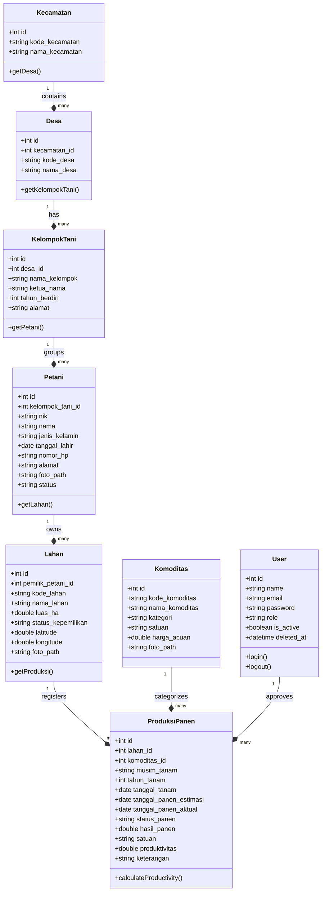

# Class Diagram
## Backend Domain Model Relationships

```mermaid
classDiagram
    class User {
        +int id
        +string name
        +string email
        +string password
        +string role
        +boolean is_active
        +datetime deleted_at
        +login()
        +logout()
    }

    class Kecamatan {
        +int id
        +string kode_kecamatan
        +string nama_kecamatan
        +getDesa()
    }

    class Desa {
        +int id
        +int kecamatan_id
        +string kode_desa
        +string nama_desa
        +getKelompokTani()
    }

    class KelompokTani {
        +int id
        +int desa_id
        +string nama_kelompok
        +string ketua_nama
        +int tahun_berdiri
        +string alamat
        +getPetani()
    }

    class Petani {
        +int id
        +int kelompok_tani_id
        +string nik
        +string nama
        +string jenis_kelamin
        +date tanggal_lahir
        +string nomor_hp
        +string alamat
        +string foto_path
        +string status
        +getLahan()
    }

    class Lahan {
        +int id
        +int pemilik_petani_id
        +string kode_lahan
        +string nama_lahan
        +double luas_ha
        +string status_kepemilikan
        +double latitude
        +double longitude
        +string foto_path
        +getProduksi()
    }

    class Komoditas {
        +int id
        +string kode_komoditas
        +string nama_komoditas
        +string kategori
        +string satuan
        +double harga_acuan
        +string foto_path
    }

    class ProduksiPanen {
        +int id
        +int lahan_id
        +int komoditas_id
        +string musim_tanam
        +int tahun_tanam
        +date tanggal_tanam
        +date tanggal_panen_estimasi
        +date tanggal_panen_aktual
        +string status_panen
        +double hasil_panen
        +string satuan
        +double produktivitas
        +string keterangan
        +calculateProductivity()
    }

    Kecamatan "1" --* "many" Desa : contains
    Desa "1" --* "many" KelompokTani : has
    KelompokTani "1" --* "many" Petani : groups
    Petani "1" --* "many" Lahan : owns
    Lahan "1" --* "many" ProduksiPanen : registers
    Komoditas "1" --* "many" ProduksiPanen : categorizes
    User "1" --* "many" ProduksiPanen : approves
```
