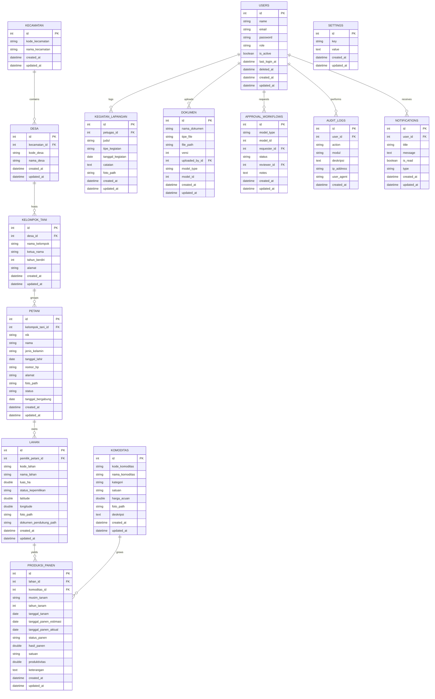

# Entity Relationship Diagram (ERD)
## Database Relational Mappings

```mermaid
erDiagram
    USERS {
        int id PK
        string name
        string email
        string password
        string role
        boolean is_active
        datetime last_login_at
        datetime deleted_at
        datetime created_at
        datetime updated_at
    }
    
    KECAMATAN {
        int id PK
        string kode_kecamatan
        string nama_kecamatan
        datetime created_at
        datetime updated_at
    }

    DESA {
        int id PK
        int kecamatan_id FK
        string kode_desa
        string nama_desa
        datetime created_at
        datetime updated_at
    }

    KELOMPOK_TANI {
        int id PK
        int desa_id FK
        string nama_kelompok
        string ketua_nama
        int tahun_berdiri
        string alamat
        datetime created_at
        datetime updated_at
    }

    PETANI {
        int id PK
        int kelompok_tani_id FK
        string nik
        string nama
        string jenis_kelamin
        date tanggal_lahir
        string nomor_hp
        string alamat
        string foto_path
        string status
        date tanggal_bergabung
        datetime created_at
        datetime updated_at
    }

    LAHAN {
        int id PK
        int pemilik_petani_id FK
        string kode_lahan
        string nama_lahan
        double luas_ha
        string status_kepemilikan
        double latitude
        double longitude
        string foto_path
        string dokumen_pendukung_path
        datetime created_at
        datetime updated_at
    }

    KOMODITAS {
        int id PK
        string kode_komoditas
        string nama_komoditas
        string kategori
        string satuan
        double harga_acuan
        string foto_path
        text deskripsi
        datetime created_at
        datetime updated_at
    }

    PRODUKSI_PANEN {
        int id PK
        int lahan_id FK
        int komoditas_id FK
        string musim_tanam
        int tahun_tanam
        date tanggal_tanam
        date tanggal_panen_estimasi
        date tanggal_panen_aktual
        string status_panen
        double hasil_panen
        string satuan
        double produktivitas
        text keterangan
        datetime created_at
        datetime updated_at
    }

    KEGIATAN_LAPANGAN {
        int id PK
        int petugas_id FK
        string judul
        string tipe_kegiatan
        date tanggal_kegiatan
        text catatan
        string foto_path
        datetime created_at
        datetime updated_at
    }

    DOKUMEN {
        int id PK
        string nama_dokumen
        string tipe_file
        string file_path
        int versi
        int uploaded_by_id FK
        string model_type
        int model_id
        datetime created_at
        datetime updated_at
    }

    APPROVAL_WORKFLOWS {
        int id PK
        string model_type
        int model_id
        int requester_id FK
        string status
        int reviewer_id FK
        text notes
        datetime created_at
        datetime updated_at
    }

    AUDIT_LOGS {
        int id PK
        int user_id FK
        string action
        string modul
        text deskripsi
        string ip_address
        string user_agent
        datetime created_at
    }

    NOTIFICATIONS {
        int id PK
        int user_id FK
        string title
        text message
        boolean is_read
        string type
        datetime created_at
        datetime updated_at
    }

    SETTINGS {
        int id PK
        string key
        text value
        datetime created_at
        datetime updated_at
    }

    KECAMATAN ||--o{ DESA : contains
    DESA ||--o{ KELOMPOK_TANI : hosts
    KELOMPOK_TANI ||--o{ PETANI : groups
    PETANI ||--o{ LAHAN : owns
    LAHAN ||--o{ PRODUKSI_PANEN : yields
    KOMODITAS ||--o{ PRODUKSI_PANEN : grows
    USERS ||--o{ KEGIATAN_LAPANGAN : logs
    USERS ||--o{ AUDIT_LOGS : performs
    USERS ||--o{ NOTIFICATIONS : receives
    USERS ||--o{ DOKUMEN : uploads
    USERS ||--o{ APPROVAL_WORKFLOWS : requests
```
