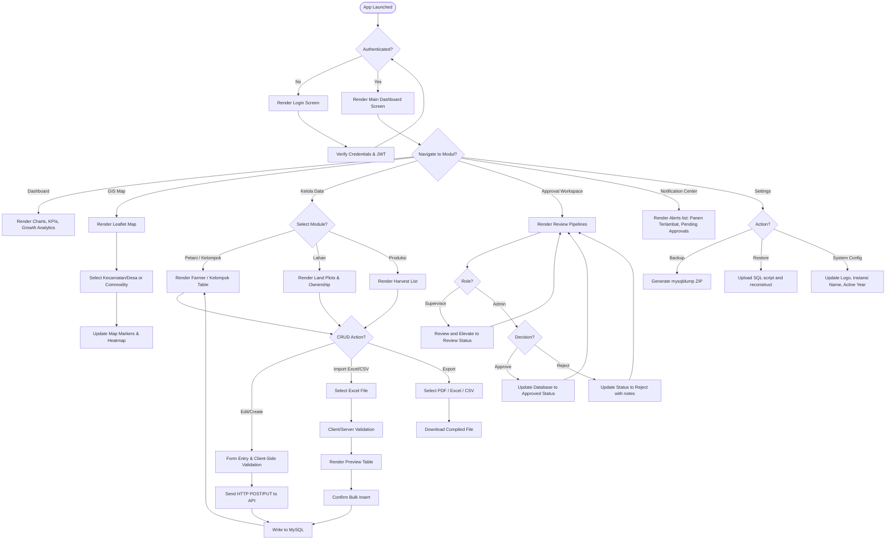

# System Flowchart
## SIMDATAN Navigation & Operation Flowchart

```mermaid
flowchart TD
    start([App Launched]) --> auth{Authenticated?}
    auth -- No --> loginPage[Render Login Screen] --> postLogin[Verify Credentials & JWT] --> auth
    auth -- Yes --> landing[Render Main Dashboard Screen]

    landing --> sidebar{Navigate to Modul?}
    
    %% Dashboard
    sidebar -- Dashboard --> dashboard[Render Charts, KPIs, Growth Analytics]
    
    %% GIS Map
    sidebar -- GIS Map --> gis[Render Leaflet Map]
    gis --> filterGIS[Select Kecamatan/Desa or Commodity]
    filterGIS --> renderMarkers[Update Map Markers & Heatmap]
    
    %% Data Management
    sidebar -- Kelola Data --> records{Select Module?}
    records -- Petani / Kelompok --> viewFarmers[Render Farmer / Kelompok Table]
    records -- Lahan --> viewLands[Render Land Plots & Ownership]
    records -- Produksi --> viewHarvest[Render Harvest List]
    
    %% Operations
    viewFarmers & viewLands & viewHarvest --> crudAction{CRUD Action?}
    crudAction -- Edit/Create --> formInput[Form Entry & Client-Side Validation] --> apiSubmit[Send HTTP POST/PUT to API] --> dbSync[Write to MySQL] --> viewFarmers
    crudAction -- Import Excel/CSV --> uploadFile[Select Excel File] --> validateFile[Client/Server Validation] --> previewData[Render Preview Table] --> commitImport[Confirm Bulk Insert] --> dbSync
    crudAction -- Export --> exportAction[Select PDF / Excel / CSV] --> downloadReport[Download Compiled File]
    
    %% Approvals
    sidebar -- Approval Workspace --> listSubmissions[Render Review Pipelines]
    listSubmissions --> checkRole{Role?}
    checkRole -- Supervisor --> reviewSubmit[Review and Elevate to Review Status] --> listSubmissions
    checkRole -- Admin --> finalDecision{Decision?}
    finalDecision -- Approve --> commitApprove[Update Database to Approved Status] --> listSubmissions
    finalDecision -- Reject --> commitReject[Update Status to Reject with notes] --> listSubmissions
    
    %% Notifications
    sidebar -- Notification Center --> viewAlerts[Render Alerts list: Panen Terlambat, Pending Approvals]
    
    %% Settings
    sidebar -- Settings --> adminSettings{Action?}
    adminSettings -- Backup --> trigBackup[Generate mysqldump ZIP]
    adminSettings -- Restore --> uploadSQL[Upload SQL script and reconstruct]
    adminSettings -- System Config --> updateMetadata[Update Logo, Instansi Name, Active Year]
```
