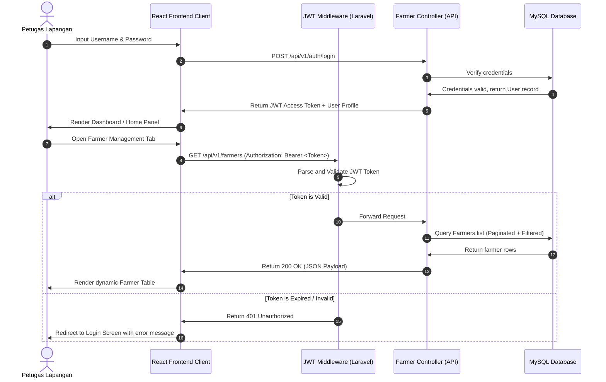

# Sequence Diagram
## Process: JWT Authentication and Farmer Profile Access

```mermaid
sequenceDiagram
    autonumber
    actor Petugas as Petugas Lapangan
    participant React as React Frontend Client
    participant Middleware as JWT Middleware (Laravel)
    participant Controller as Farmer Controller (API)
    participant Database as MySQL Database

    %% Login Process
    Petugas->>React: Input Username & Password
    React->>Controller: POST /api/v1/auth/login
    Controller->>Database: Verify credentials
    Database->>Controller: Credentials valid, return User record
    Controller->>React: Return JWT Access Token + User Profile
    React->>Petugas: Render Dashboard / Home Panel

    %% Farmer Retrieval Process
    Petugas->>React: Open Farmer Management Tab
    React->>Middleware: GET /api/v1/farmers (Authorization: Bearer <Token>)
    Middleware->>Middleware: Parse and Validate JWT Token
    alt Token is Valid
        Middleware->>Controller: Forward Request
        Controller->>Database: Query Farmers list (Paginated + Filtered)
        Database->>Controller: Return farmer rows
        Controller->>React: Return 200 OK (JSON Payload)
        React->>Petugas: Render dynamic Farmer Table
    else Token is Expired / Invalid
        Middleware->>React: Return 401 Unauthorized
        React->>Petugas: Redirect to Login Screen with error message
    end
```
